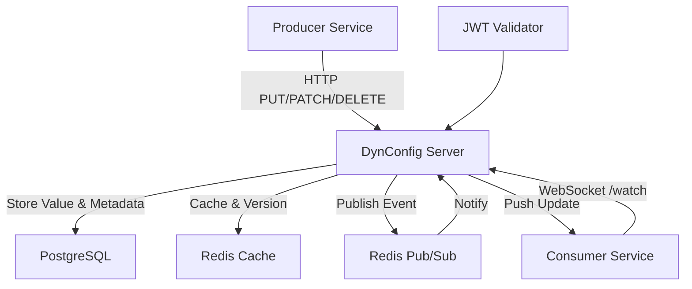

# DynConfig Server

DynConfig is a centralized, secure configuration management system designed as a key-value store that supports real-time configuration updates and propagation to consuming services without requiring restarts. It uses a RESTful HTTP API with WebSocket-based change notifications and enforces strict access control using JSON Web Tokens (JWTs) containing a `username` claim.

## Intended Audience

This documentation is intended for developers, DevOps engineers, and system architects building or maintaining distributed systems that require dynamic configuration management. Familiarity with REST APIs, WebSockets, JWT authentication, PostgreSQL, and Redis is assumed. For foundational concepts like JWTs or eventual consistency, refer to [RFC 7519 (JWT)](https://datatracker.ietf.org/doc/html/rfc7519) or general distributed systems resources.

## Overview

DynConfig enables:
- **Dynamic Updates**: Producers (e.g., admin services) register or update key-value pairs via HTTP.
- **Real-Time Propagation**: Consumers (e.g., application services) receive updates via WebSockets, updating in-memory configurations without restarts.
- **Security**: Per-key access control lists (ACLs) restrict read/write access to authorized entities, authenticated via JWTs with a `username` claim.
- **Scalability and Reliability**: Built with Clojure, PostgreSQL for persistent storage, and Redis for caching and event propagation.

### Key Principles
- **Immutability of Metadata**: Key metadata (e.g., ACLs) is immutable after creation unless updated by admins.
- **Consistency Model**:
  - Updates are **atomic per key**.
  - Each update increments a **monotonic version number** for the key (a strictly increasing integer ensuring ordered updates).
  - Consumers achieve **eventual consistency**, with propagation delays typically under 1 second.
- **Data Model**:
  - **Key**: Unique string identifier (e.g., `app.feature-toggle.enabled`), supporting hierarchical paths (e.g., `namespace/app/key`).
  - **Value**: JSON-serializable data (string, boolean, number), max 1MB.
  - **Metadata**: Includes TTL (optional), version, ACLs (read/write lists or wildcards), and last-modified timestamp.
  - **Entities**: Identified by JWT `username` claim (user/service ID).

## Use Cases

DynConfig is ideal for:
- **Feature Toggles**: Enable/disable features across services without redeploys (e.g., `app.feature-toggle.new-ui`).
- **Secret Management**: Rotate API keys or database credentials with TTLs and ACLs.
- **Runtime Adjustments**: Tune logging levels (`system.logging.level`) or connection pools in production.
- **A/B Testing**: Propagate experiment configurations to subsets of services via ACLs.

## Getting Started

### Prerequisites
- PostgreSQL and Redis instances (local or cloud).

### Quick Setup with Docker Compose
Create a `docker-compose.yml` file:

```yaml
version: '3.8'
services:
  postgres:
    image: postgres:15
    environment:
      - POSTGRES_DB=dynconfig
      - POSTGRES_USER=admin
      - POSTGRES_PASSWORD=secret
    volumes:
      - postgres_data:/var/lib/postgresql/data

  redis:
    image: redis:7-alpine

volumes:
  postgres_data:
```

Run with `docker-compose up`.

### Example Usage

1. **Authenticate**: Obtain a JWT containing a `username` claim for admin actions.

2. **Create a Key**:
   ```bash
   curl -X PUT http://localhost:8080/keys/app.feature-toggle.enabled \
     -H "Authorization: Bearer <your-jwt>" \
     -H "Content-Type: application/json" \
     -d '{
       "value": "true",
       "ttl": 3600,
       "acls": {
         "read": ["*"],
         "write": ["admin-user"]
       }
     }'
   ```
   Response: `{"key": "app.feature-toggle.enabled", "version": 1, "lastModified": "2025-09-21T20:03:00Z"}`

3. **Fetch a Key**:
   ```bash
   curl -X GET http://localhost:8080/keys/app.feature-toggle.enabled \
     -H "Authorization: Bearer <your-jwt>"
   ```
   Response: `{"key": "app.feature-toggle.enabled", "value": "true", "version": 1}`

4. **Subscribe to Updates (WebSocket Example in JavaScript)**:
   ```javascript
   const ws = new WebSocket('ws://localhost:8080/watch');
   ws.onopen = () => {
     ws.send(JSON.stringify({ subscribe: ['app.*'] }));
   };
   ws.onmessage = (event) => {
     const update = JSON.parse(event.data);
     console.log('Update:', update);  // e.g., { event: 'update', key: '...', value: 'false' }
   };
   ```

## Architecture



This diagram illustrates the flow: Producers update via HTTP, stored in PostgreSQL and cached in Redis. Changes are published to Redis pub/sub, which notifies WebSocket-connected consumers.

## Features

### Core Functionality
- **Write Operations**:
  - `PUT` a key with value + metadata (create or replace).
  - `PATCH` value only (no metadata updates unless admin).
  - `DELETE` a key (soft-delete with version increment).
- **Read Operations**:
  - Fetch a single key’s value.
  - List keys by namespace or ACLs.
  - Subscribe to changes via WebSockets.
- **Propagation**:
  - Consumers subscribe via WebSocket (`/watch`) with one connection handling multiple keys/namespaces.
  - Client libraries update in-memory configs via callbacks.

### API Endpoints
All requests require `Authorization: Bearer <jwt>` with a valid `username` claim.

| Method | Endpoint | Description | Request Body | Response |
|--------|----------|-------------|--------------|----------|
| PUT | `/keys/{key}` | Create or replace key | `{ "value": "true", "ttl": 3600, "acls": { "read": ["*"], "write": ["admin-user"] } }` | `{ "key": "app.feature-toggle.enabled", "version": 1, "lastModified": "2025-09-21T20:03:00Z" }` |
| PATCH | `/keys/{key}` | Update key value only | `{ "value": "false" }` | `{ "key": "app.feature-toggle.enabled", "version": 2, "lastModified": "2025-09-21T20:05:00Z" }` |
| GET | `/keys/{key}` | Fetch key value | None | `{ "key": "app.feature-toggle.enabled", "value": "false", "version": 2 }` |
| DELETE | `/keys/{key}` | Delete key (soft-delete) | None | 204 No Content |
| GET | `/keys` | List keys | Query: `?namespace=app&limit=100` | `{ "keys": ["app.key1", "app.key2"], "total": 2 }` |
| GET | `/watch` | Watch multiple keys/namespaces (WebSocket) | Initial message: `{ "subscribe": ["app.*", "system.logging.level"] }` | Stream of updates: `{ "event": "update", "key": "app.feature-toggle.enabled", "version": 3, "value": "true" }` |
| GET | `/health` | Check server health | None | `{ "status": "healthy" }` |

- **Error Handling**: JSON with HTTP status codes (e.g., 401: `{ "error": "Unauthorized", "message": "Invalid JWT" }`; 404: `{ "error": "Not Found", "message": "Key does not exist" }`; 429: `{ "error": "Rate Limited", "message": "Exceed 1000 req/min" }`).
- **Rate Limiting**: 1000 req/min per JWT; enforced via Redis, returns HTTP 429 on exceedance. Configurable via environment variables.

## Propagation
- **Mechanism**: WebSockets with Redis pub/sub for distribution.
- **Multiplexing**: One connection can watch many keys/namespaces (up to 1000 subscriptions per connection).
- **Fallback**: Consumers may poll with `?since_version={last_known}` for missed updates.
- **Performance**: Sub-second latency expected (e.g., <500ms p99 under 10k connections).

## Security
- **Authentication**:
  - JWTs validated via a JWKS endpoint, containing only a `username` claim.
  - Tokens are short-lived (e.g., 1h).
- **Authorization**:
  - Per-key ACLs defined at creation:

        {
          "read": ["service:payment-api", "admin-user"],
          "write": ["admin-user"]
        }

  - Wildcards allowed (`"read": ["*"]`).
  - Namespace-level ACLs optional for inheritance.
  - Users with `admin-user` in ACLs may update metadata and override.
- **Auditing**:
  - All operations logged (who, what, when).
  - Logs persisted in PostgreSQL; optionally streamed to Kafka/ELK.
- **Protections**:
  - Values encrypted at rest (AES-256) and in transit (TLS 1.3).
  - Input validation and sanitization.
  - Secrets can have TTLs with auto-expiry and rotation.
  - Monitoring with Prometheus metrics and anomaly alerts.

## TTL & Expiry
- Expired keys are marked as deleted and removed from queries.
- Consumers watching an expired key receive an `expired` event:

      {
        "event": "expired",
        "key": "app.session.token",
        "version": 5
      }

- Stale values are not returned via GET once expired.

## Failure Handling
- **Redis outage**: Updates queue in Postgres; propagation continues once Redis recovers.
- **Consumer disconnect**: Clients may reconnect with `?since_version` to catch up.
- **Service crash**: State is recoverable from Postgres.

## FAQ

- **How to handle WebSocket reconnects?** Use exponential backoff and resubscribe with `since_version` from the last acknowledged update.
- **What if a key’s TTL expires during subscription?** You'll receive an `expired` event; unsubscribe and refetch if needed.
- **Scaling for high traffic?** Use Kubernetes for horizontal scaling (stateless except DB/Redis); shard Redis if >1M keys.
- **WebSocket connection limits?** Up to 10k concurrent; monitor via Prometheus.

## Implementation
DynConfig is implemented in **Clojure**, leveraging immutability and concurrency primitives, with **PostgreSQL** for persistence and **Redis** for caching and event propagation.

### Tech Stack
- **API Server**: Clojure with Ring + Compojure.
- **Storage**: PostgreSQL (`configs` table with JSONB + versioning).
- **Cache/Events**: Redis pub/sub.

### Key Dependencies
- `ring` — HTTP server.
- `reitit` — routing.
- `http-kit` — WebSockets.
- `carmine` — Redis client.
- `buddy-auth` — JWT handling.

### Deployment Notes
- Validate JWTs against a JWKS endpoint, ensuring a valid `username` claim.
- Configure PostgreSQL for durability and Redis for event distribution.
- Export Prometheus metrics (latency, error rates, connection counts).
- Audit logs replicated to a secure system.
- Environment Variables: `POSTGRES_URL`, `REDIS_HOST`, `JWKS_URL`, `RATE_LIMIT=1000`.

### Testing
- Validate health: `curl http://localhost:8080/health`.
- Simulate propagation: Use the example client to subscribe and update a key.

## Contributing
Feedback and contributions are welcome! Please submit issues or PRs to refine the API, security model, or propagation logic. Run `lein test` before submitting.

## License
MIT
